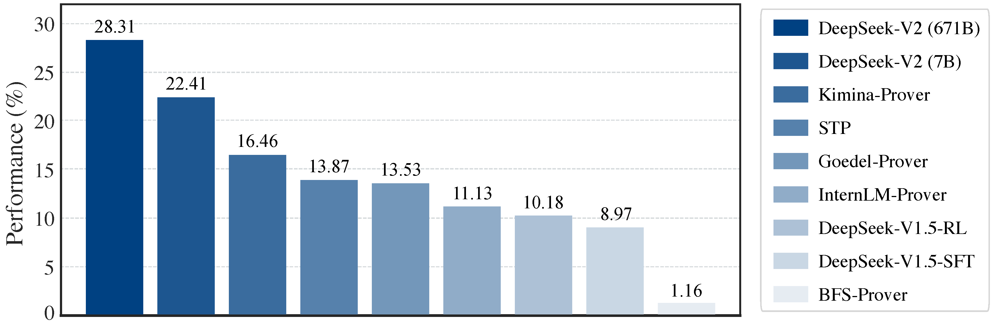
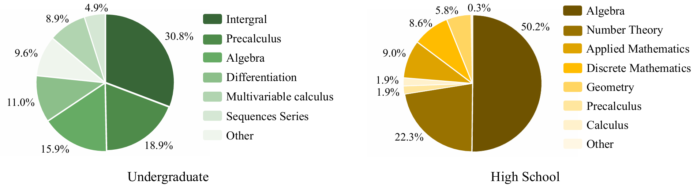
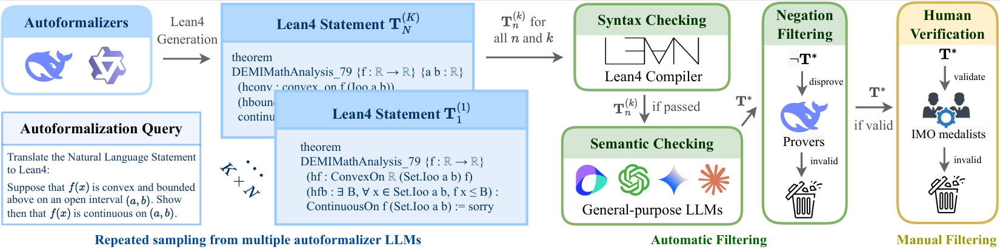

# FormalMATH

>  **[Arxiv] FormalMATH: Benchmarking Formal Mathematical Reasoning of Large Language Models**.
[Paper Link](https://arxiv.org/abs/2505.02735)
<p align="center"></p>

### Open-Source Links


| Datasets | Paper | Project Page |
 |:-----------------:|:----------------:|:--------------:|
 |[](https://huggingface.co/SphereLab)|[](https://arxiv.org/abs/2505.02735)|<a href="https://sphere-ai-lab.github.io/FormalMATH/"></a>|
## 📊 Introduction
FormalMATH is a large-scale benchmark dataset for formal mathematical reasoning, consisting of 5,560 formally verified mathematical statements across various domains and difficulty levels in Lean4. It is designed to advance research in automated theorem proving by providing a comprehensive and reliable testbed for evaluating AI systems, and introduces a human-in-the-loop pipeline that leverages language models and automated checking to efficiently generate formalized math statements.
<p align="center"></p>

## 🗼 Pipeline of FormalMATH Construction
The FormalMATH pipeline combines fine-tuned large language models with a best-of-N sampling approach to automatically generate formal mathematical statements. It then applies a multi-step automated validation process, including compiler checking, semantic verification by multiple LLMs, logical filtering using a pre-trained prover, and final human review to ensure correctness.
<p align="center"></p>

## 📰 News
* [5/04/2025]  **Open-Sourcing datasets** For specific steps, refer to Get Started.

## 🏆 Prover Performance
Performance comparison of theorem prover LLMs on **FormalMATH-All**.

| Method | Sampling budget | Pass@K(%) |
| --------- |  :-------: | :-------: |
| DeepSeek-V2-671B | $32$ | $28.31$ |
| DeepSeek-V2-7B | $32$ | $22.41$ |
| Kimina-Prover-7B | $32$ | $16.46$ |
| STP | $32$ | $13.87$ |
| Goedel-Prover | $32$ | $13.53$ |
| DeepSeek-V1.5-RL | $32$ | $10.18$ |
| DeepSeek-V1.5-SFT | $32$ | $8.97$ |
| InterLM-Prover | $32$ | $11.13$ |
| BFS-Prover | $32$ | $1.16$ |

Performance comparison of theorem prover LLMs on **FormalMATH-Lite**.

**Best-First Tree Search Methods**
| Method | Sampling budget | Pass@K(%) |
| --------- | :-------:  | :-------: |
| BFS(DeepSeek-V1.5-RL) | $32\times32\times100$ | $17.41$ |
| BFS(InternLM-V2.5) | $32\times32\times100$ | $25.65$ |
| BFS(BFS-Prover) | $32\times32\times100$ | $45.88$ |

**Single-Pass Generation Methods**
| Method | Sampling budget | Pass@K(%) |
| --------- |  :-------: | :-------: |
| Kimina-Prover-7B | $3200$ | $48.94$ |
| STP | $3200$ | $53.17$ |
| DeepSeek-V1.5-SFT | $3200$ | $46.82$ |
| DeepSeek-V1.5-RL | $3200$ | $50.35$ |
| Goedel-Prover | $3200$ | $49.41$ |


## 🔧 Installation
### Step1 : Installing Evaluation Environment on Host Machine
- Python 3
- Pytorch
- Install the required dependency packages 
```bash
pip install -r requirements.txt
```
### Step2 : Installing LEAN4 & REPL Enviroment on Host Machine
Lean installation
```
cd ~
curl https://raw.githubusercontent.com/leanprover/elan/master/elan-init.sh -sSf | sh
source $HOME/.elan/env
```

REPL installation
```
git clone https://github.com/leanprover-community/repl.git && cd repl && git checkout adbbfcb9d4e61c12db96c45d227de92f21cc17dd
lake build
cd ..
```

Mathlib installation
```
cd ~/repl/test/Mathlib
bash test.sh
```


## 🏃 Get Started
### 📌 Core Configuration Parameters

Please make sure you have correctly configured the following key parameters for generating answers, verifying answers, and evaluating results in the evaluation system.
| Parameter | Description | Default |
| --------- | ----------- | ------- |
| `--auto_dl` | Automatically download dataset. | `True` |
| `--datasets` | Choose dataset version: FomaMATH-All or FomaMATH-Lite. | `FomaMATH-All` |
| `--generate` | Enable generation of answers. | `False` |
| `--verify` | Enable verification of generated answers. | `False` |
| `--evaluate` | Enable evaluation of verification results. | `False` |
| `--input_file` | Path to the input file containing the questions. | `None` |
| `--generated_file` | Path to the output file for generated answers. | `None` |
| `--verification_file` | Path to the output file for verification results. | `None` |
| `--evaluation_file` | Path to the output file for evaluation results. | `None` |
| `--model` | Path to the model used for generating answers. | `None` |
| `--repl_path` | Path to the REPL environment. | `./repl` |
| `--lean_env_path` | Path to the Mathlib4 environment. | `./repl/test/Mathlib` |
| `--n` | Number of answers to generate per process. | `1` |
| `--nums_answer` | Number of answers to generate per question. | `1` |
| `--num_batches` | Number of processes to verify answers per question. | `1` |

For more personalized parameter settings, please refer to `FoMA_Eval.py.`


Note 1: Note that if `args.auto_dl` is `true`, it will automatically download the dataset to `./data` by default, and automatically preset the paths for `args.input_file`, `args.generated_file`, `args.verification_file`, and `args.evaluation_file`. If you want to customize the paths, please set this parameter to `False`.
 
Note 2: If you meet the error `"RuntimeError: Aborted due to the lack of CPU swap space. Please increase the swap space to avoid this error."`, try reduce parameter `args.n`.

### 📌 Quick Evaluation
If you want to directly obtain the test results of the model from FomalMATH, we provide a one-time testing tool `FoMA_Eval.py`. Please run the following:
```bash
# If you want to automatically download the dataset FomaMATH-All
 python FoMA_Eval.py --auto_dl --generate --verify --evaluate \
     --datasets FomaMATH-All \
     --model your_model_path \
     --n 32 \
     --nums_answer 32 \
     --num_batches 1
 
 # If you want to customize file paths 
python FoMA_Eval.py --generate --verify --evaluate \
    --input_file your_datasets_path \
    --generated_file your_generated_file_path \
    --verification_file your_verify_file_path \
    --evaluation_file your_evalute_file_path \
    --model your_model_path \
    --repl_path your_repl_path \
    --lean_env_path your_mathlib_path \
    --n 200 \
    --nums_answer 3200 \
    --num_batches 128 
```
### 📌 Detailed Evaluation
`FoMA_Eval.py` can independently perform generation, verification, and evaluation tasks. It can also save intermediate results to meet the needs of different downstream tasks. Please refer to the following instructions for details:

- If you only want to generate answers, please run the following:
```bash
python generate_answers.py --generate \
    --input_file your_datasets_path \
    --output_file your_generated_file_path \
    --model your_model_path \
    --n 200 \
    --nums_answer 3200 
```
- If you only want to verify the generated answers, please run the following:
```bash
python lean_proof_pipeline.py --verify \
    --generated_file your_generated_file_path \
    --verification_file your_verify_file_path \
    --num_batches 128 \
    --expect_timeout 120 
```
- If you only want to evaluate verify result, please run the following:
```bash
python evaluate_results.py --generate \
    --verification_file your_verify_file_path \
    --evaluation_file your_evalute_file_path 
```
## 📋 Citation
If you find our project interesting, please cite us 😊
```bibtex
@misc{yu2025formalmathbenchmarkingformalmathematical,
        title={FormalMATH: Benchmarking Formal Mathematical Reasoning of Large Language Models}, 
        author={Zhouliang Yu and Ruotian Peng and Keyi Ding and Yizhe Li and Zhongyuan Peng and Minghao Liu and Yifan Zhang and Zheng Yuan and Huajian Xin and Wenhao Huang and Yandong Wen and Ge Zhang and Weiyang Liu},
        year={2025},
        eprint={2505.02735},
        archivePrefix={arXiv},
        primaryClass={cs.AI},
        url={https://arxiv.org/abs/2505.02735}, 
}
```
## 📈 Star Rising
[](https://www.star-history.com/#Sphere-AI-Lab/FormalMATH-Bench&Date)
